# xxxmas - Quyet Dao

Demo: https://qyt0109.github.io/xxxmas/

## Hướng dẫn làm

### B1: Đăng ký Github nếu chưa có tài khoản

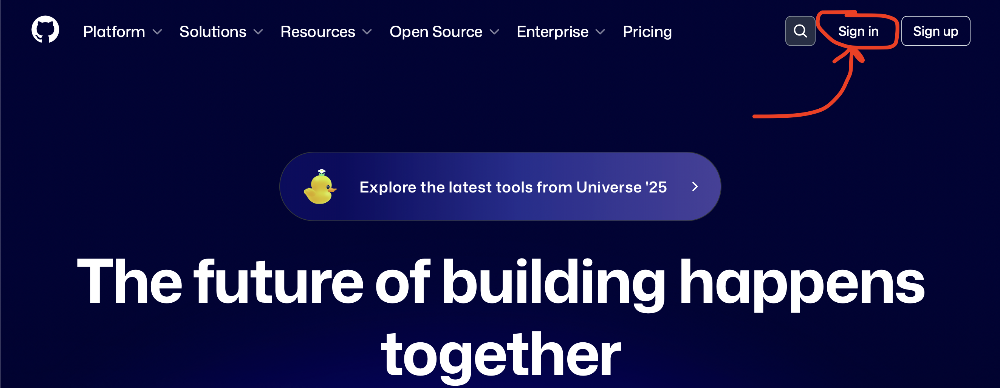

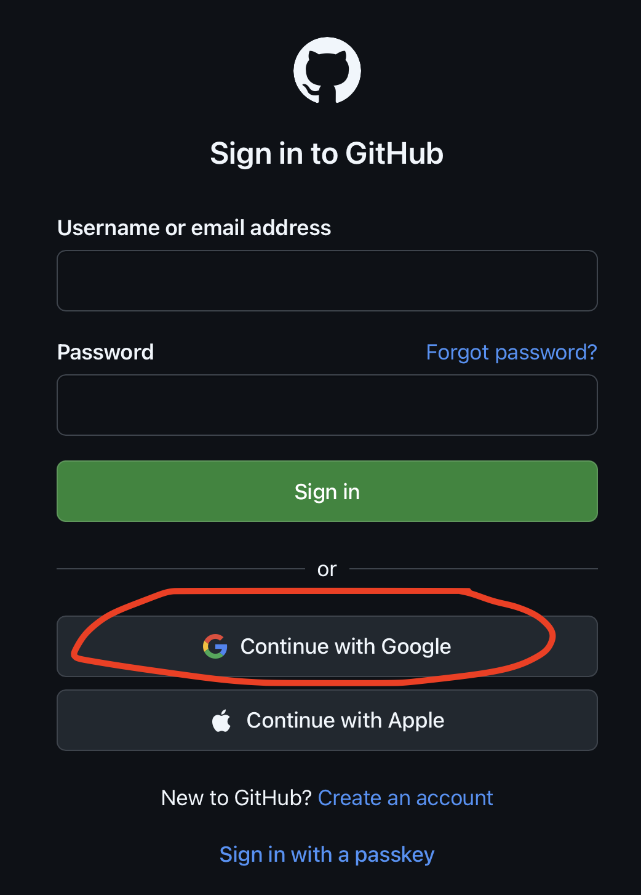

### B2: Tìm tới project

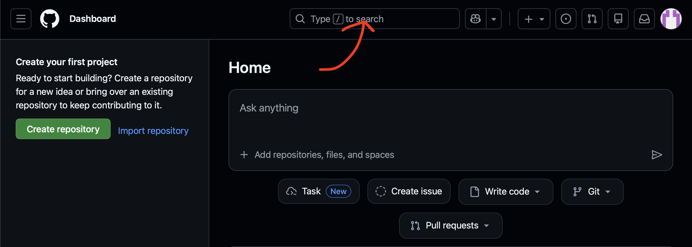

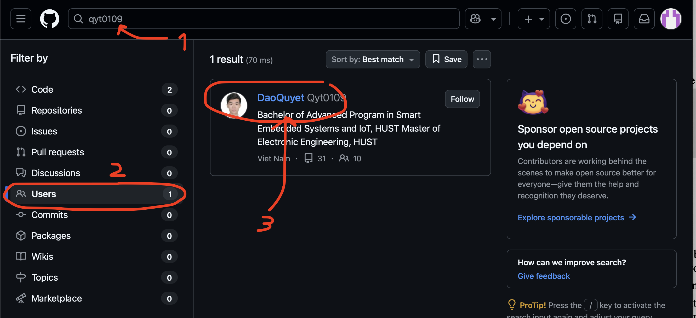

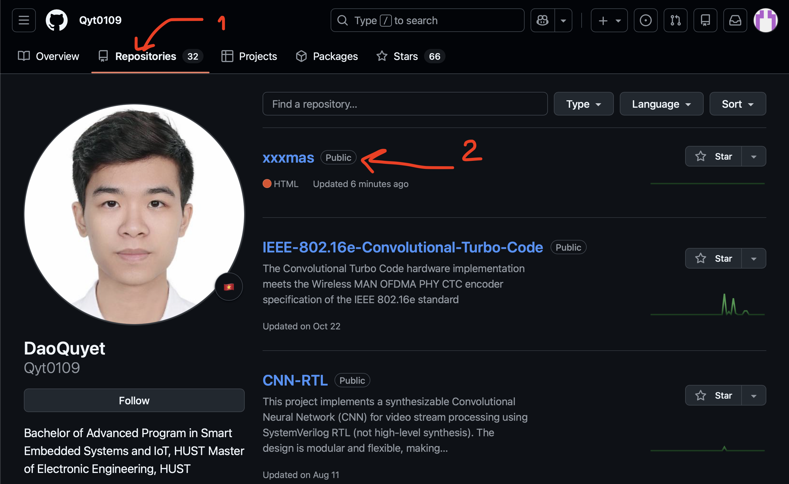

### B3: Lưu về thành của bạn

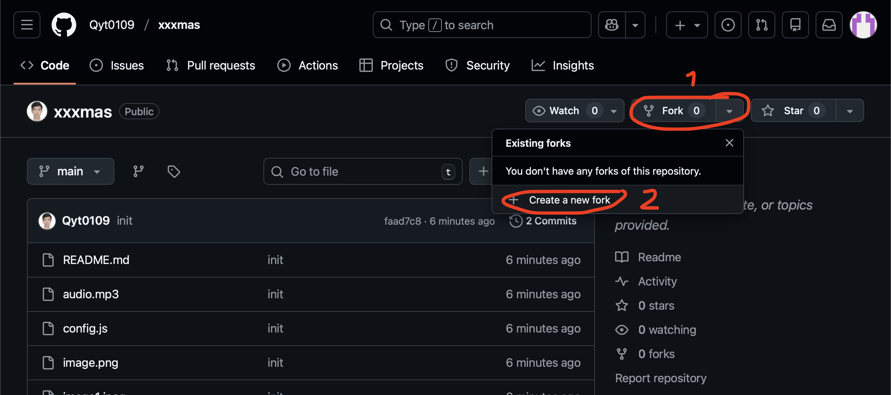

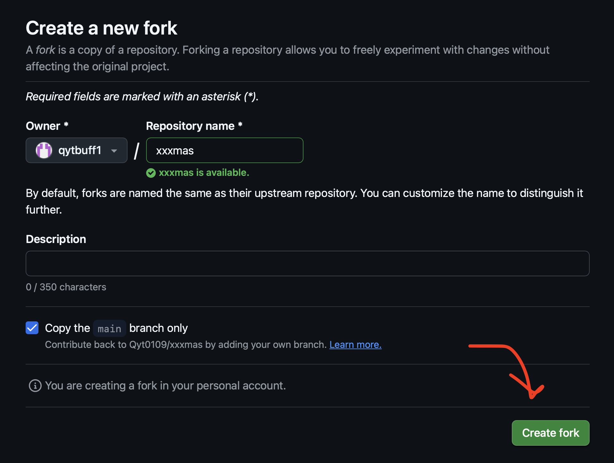

### B4: Thay đổi text, hình ảnh của trang web

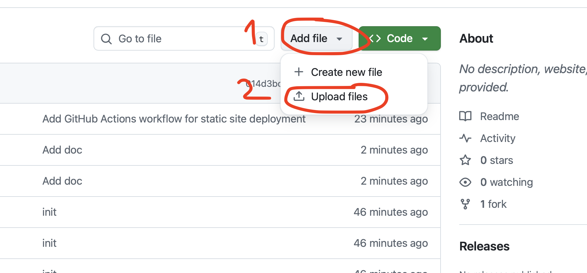

Thêm ảnh vào project

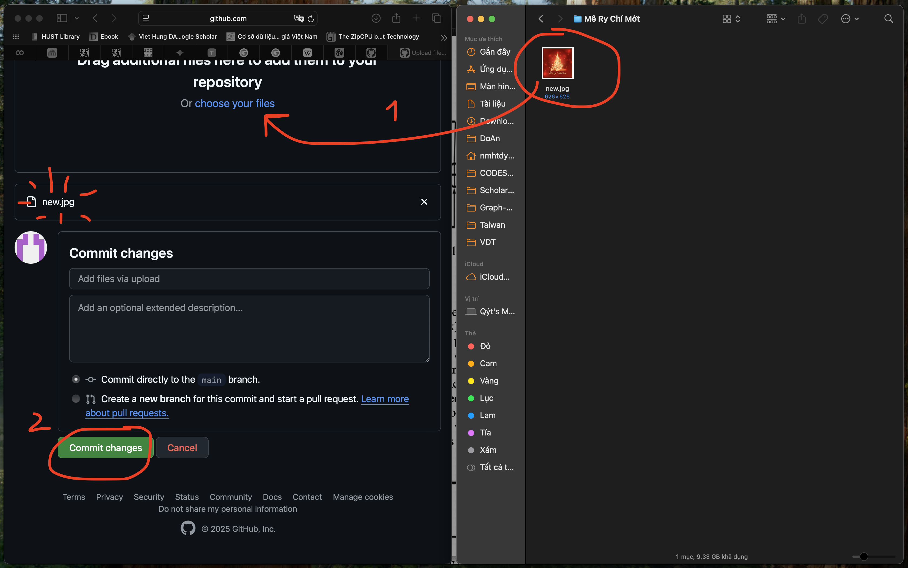

Sửa file [config.js](./config.js)

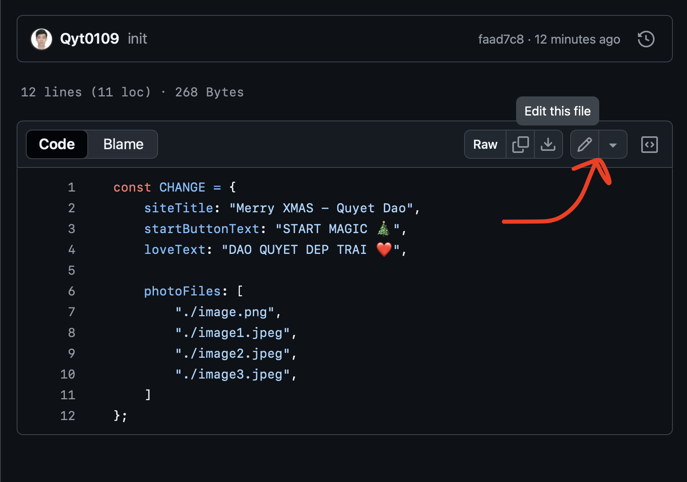

Thay đổi text (tiêu đề trang web, text trên nút bấm, text hiện ra khi thả tim 🫶)

Thay đổi list hình ảnh (4 hình)

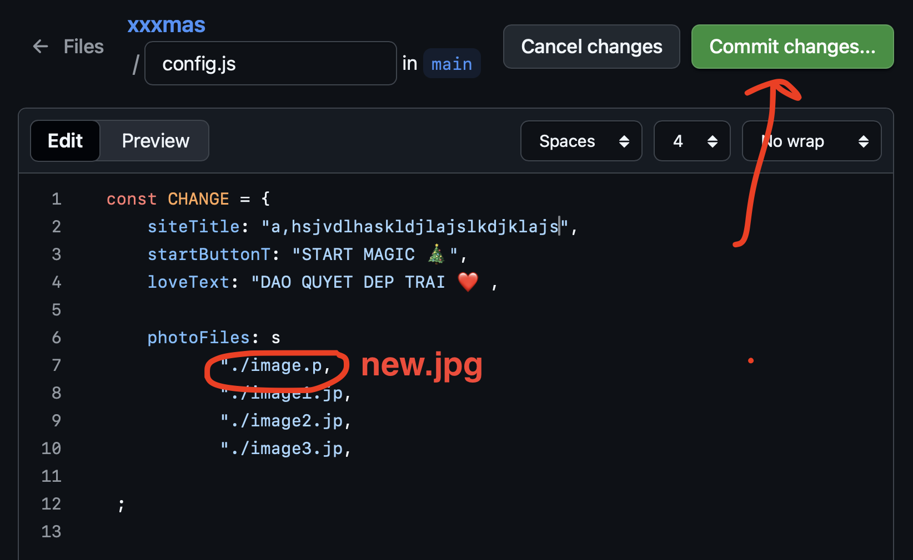

### B5: Tạo trang web

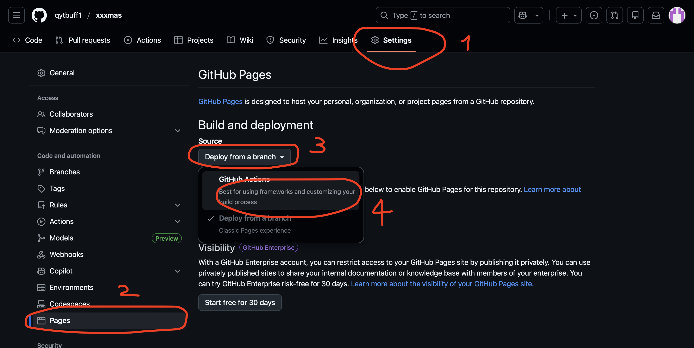

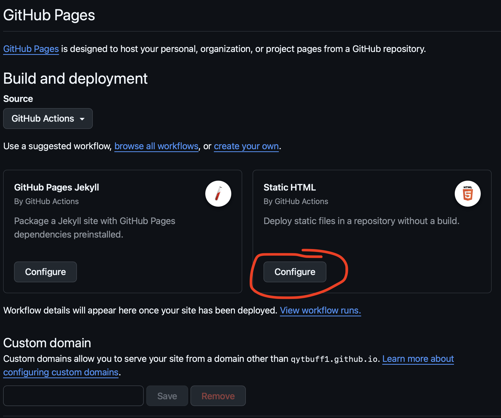

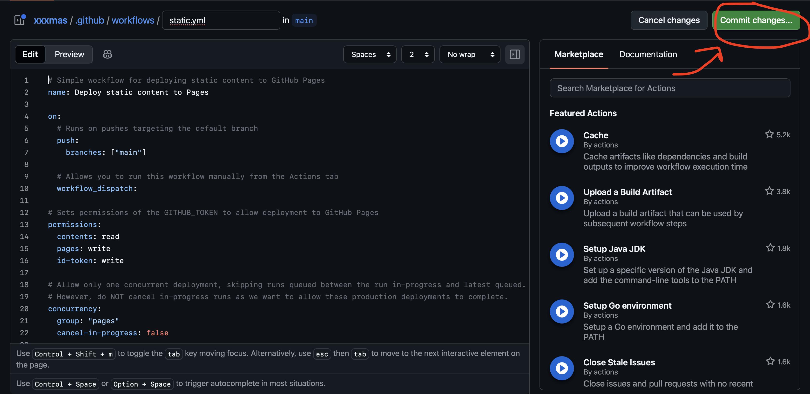

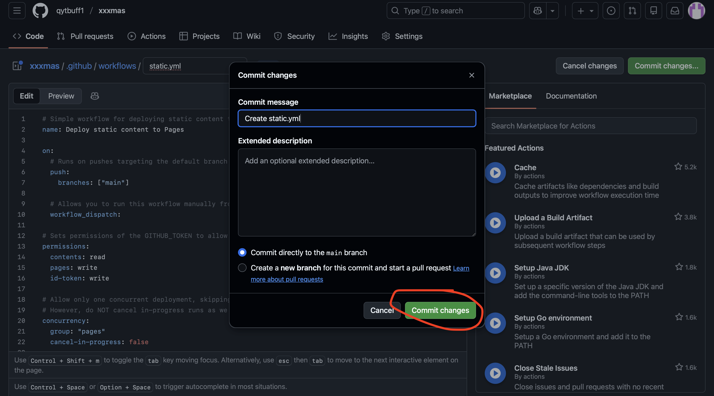

Tới bước này (check ở tab Action) thì chờ 1 tí để nó auto thiết lập, refresh trang mà thấy hiện xanh lá thế này là done rồi. Bấm vào để xem link web mới được tạo

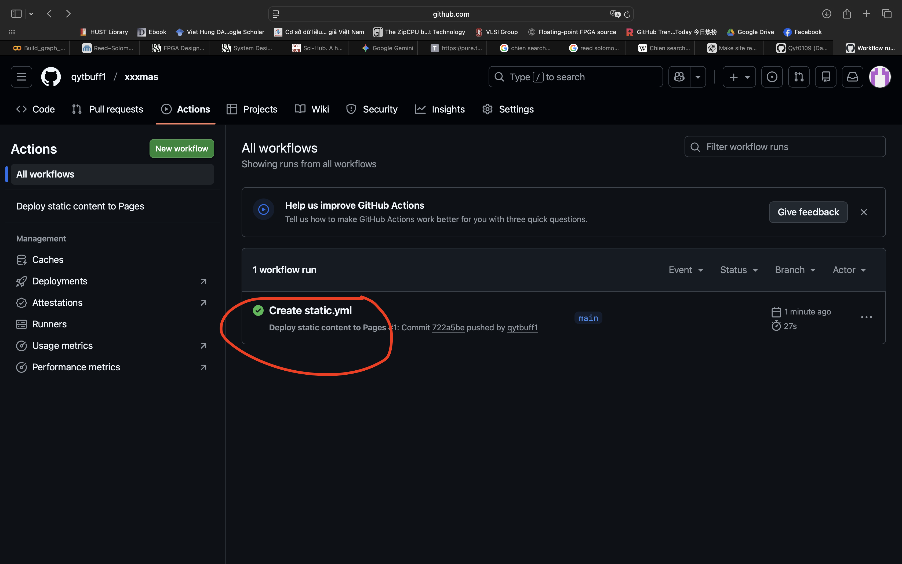

Check link web mới tạo. Have fun

